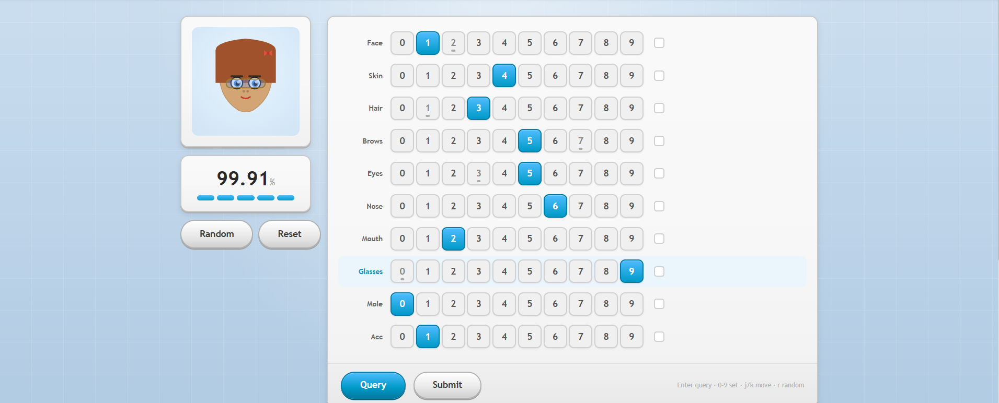

# Face Value — Solve Writeup

**Name:** Ahmad Bin Tahir
**Application Email:** #######

**Puzzle:** Face Value

## Overview



Face Value scores a ten-trait face (`faceShape`, `skinTone`, `hair`, `eyebrows`, `eyes`, `nose`, `mouth`, `glasses`, `mole`, `accessory`, each 0–9) through a hidden model. A submission is accepted only if all four returned checks pass at once:

```
probability >= 0.999
charm >= 3.0
editDistance <= 5 (Hamming)
sync = true
```

## Attempt 1 — Brute Force (Failed)

My first approach was to just brute-force the space of faces within five edits of the starter. This was a mistake: firing large batches of queries at `/api/query` overloaded the evaluator and effectively took the server down for a while. I stopped immediately, backed off, and switched to a slower, deliberate approach instead of hammering the endpoint.

## Attempt 2 — Manual Probing and Learning

I went back to changing one or two traits at a time by hand, reading each response, and building intuition for how probability, charm, and sync moved. This was slow but safe, and it taught me two things: the checks fight each other (higher probability can tank charm or sync), and some traits — especially hair and eyes — swing the score far more than others when changed.

Every query I ran, win or lose, was saved. I downloaded that query history as JSON instead of relying on memory, which gave me a real dataset to work from instead of guesswork.

## Attempt 3 — A Model That Learns the Behaviour

With that dataset, I used AI to help build a small local surrogate model: each trait one-hot encoded, trained to predict probability, charm, and sync jointly from the ~2,900 unique observations collected. This is not a copy of the hidden model — it is a local approximation trained purely on my own logged results, used to rank untested faces instead of guessing them blindly. Every candidate it favored still had to be confirmed live before it counted.

The model picked out the strongest non-winning face already satisfying charm, distance, and sync:

```
1 4 2 5 6 6 2 9 0 1   probability=0.98045   charm=4.06   sync=true
```

It then ranked which of that face's five changed traits moved the score the most, using the actual measured spread of probability per value:

| Trait | Sensitivity |
|---|---|
| hair | 0.834 |
| eyes | 0.458 |
| faceShape | 0.135 |
| eyebrows | 0.113 |
| glasses | 0.043 |

`hair` and `eyes` stood out clearly, so the search was narrowed to a 10×10 grid over just those two traits — 100 combinations instead of millions.

## Final Refinement and Proof

The model-guided grid search queried `/api/query` in order of predicted score. The relevant tail of that run, straight from `active-cache.json`, is:

| # | Code | Probability | Charm | Sync | Accepted |
|---|---|---|---|---|---|
| 23 | 1435062901 | 0.96051 | 4.34 | true | no |
| 24 | 1435162901 | 0.89396 | 4.31 | false | no |
| 25 | 1435962901 | 0.88907 | 4.15 | false | no |
| 26 | 1435262901 | 0.91423 | 4.15 | false | no |
| 27 | 1435562901 | 0.99910 | 4.92 | true | **YES** |

Query 27 passed every check, and the run stopped there. `selected-solution.json` records the confirmed result:

```
selectedFinalAnswer = 1435562901
probability = 0.9991   (>= 0.999 ✓)
charm       = 4.92     (>= 3.0 ✓)
editDistance = 5       (<= 5 ✓)
sync        = true     (= true ✓)
confirmedBy = https://facevalue.hackmit.org/api/query
```

## Final Answer

**1435562901**

This is one verified answer inside the accepted region — the acceptance rule allows more than one passing code, and different sensitive-trait pairs or refinement paths can land on different valid answers.

## Notes

- Brute force was tried first and abandoned after it overloaded the server; all later queries were slow and rate-limited on purpose.
- The dataset used for the model is my own downloaded query history, not the hidden model's weights.
- Only `/api/query` was called; the solver never calls a submit endpoint.
- Both the write-up and the solver code were updated to reflect this approach.
- Used AI to help build the surrogate model, plan the sensitivity analysis, and clean up this write-up.
- Code: [Google Drive link](https://drive.google.com/file/d/10wdXpwkHkNkLzpkaGFha1g1kBVJmWVKm/view?usp=sharing)
