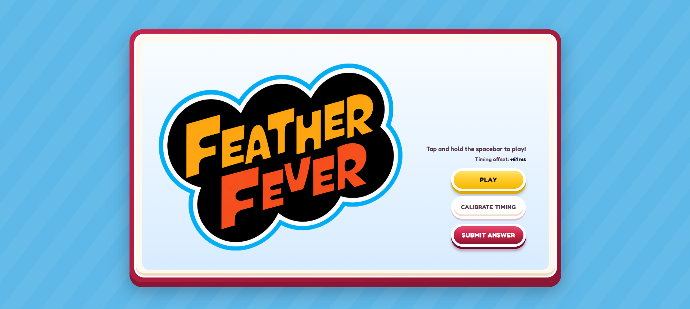
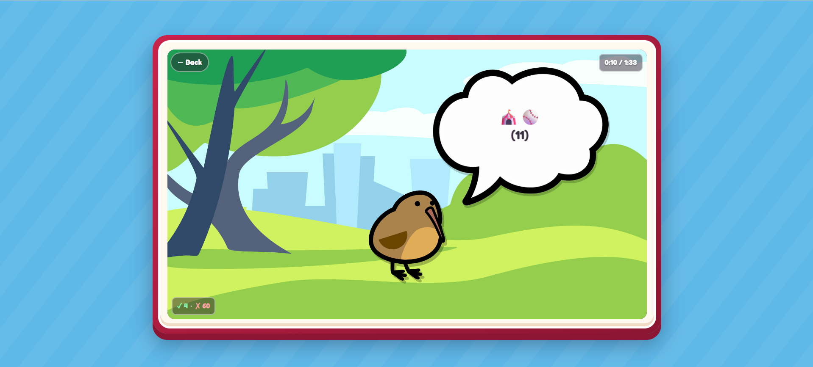

# Feather Fever — Solve Writeup

**Name:** Ahmad Bin Tahir
**Application Email:** #######

**Puzzle:** Feather Fever
Feather = Birds, Fever = Fever → Birds Class = Aves, Common Fever = Influenza → Birds Fever = Avian Influenza

## Overview



Feather Fever is a Rhythm Heaven-style timing minigame that gates its clues behind correct play, buries a Vigenère-encoded instruction in emoji clues, and hides the actual ciphertext inside a music track's percussion layer as Morse code.

## Playing the Game and Collecting Clues

The first step was to play the game and obtain the 19 clues. I tried automating this in several different ways. To keep this write-up as short as possible: the final method I used was to extract the timestamps from the JavaScript and create a Tampermonkey script. When I pressed a key, the script automatically clicked the play button and pressed the correct buttons at the required timestamps.

Despite getting everything correct, I did not unlock every clue in a single attempt. However, different iterations revealed different clues. In one iteration, I also tried manually spamming the space bar to cover all the possible hits, which revealed some additional clues. By compiling the results from multiple iterations, I eventually obtained all 19 clues.



## Decoding the Emoji Clues

The clues consisted of emojis representing words or phrases related to Rhythm Heaven, with each accompanying number indicating an index into that word or phrase. I used AI to help decode some of the emojis.

The indexed letters produced:

```
MENU THEME VIGENERE HUEBIRDS
```

This indicated that I needed to use a Vigenère cipher with the key `HUEBIRDS`. I now needed to find the ciphertext.

## Finding the Hidden Message

I examined the menu theme audio file and tried looking at its spectrogram, metadata, and oscilloscope. I also changed its playback speed to see whether it contained a hidden spoken message. I even sent the audio to AI and asked it to identify anything unusual, but none of these approaches worked.

Along with the main menu audio, I noticed two other audio files: `triangle` and `woodblock`, which appeared to be individual sound effects or notes. I found these exact sounds within the menu theme at different timestamps.

Using WavePad, I manually listened through the entire audio file and recorded the timestamps of the woodblocks and triangles down to the millisecond. Surprisingly, the woodblocks occurred at discrete whole-second timestamps, while the triangles had seemingly random millisecond values, so I was not initially confident that my triangle measurements were accurate. Since there were two different sounds, I tried interpreting them as binary and Morse code, but neither method produced anything useful.

After being stuck for days, I put the puzzle aside and returned to it later. When I looked at the timestamps again, I noticed that the woodblock timestamps formed arithmetic sequences every three terms, creating groups. I could also see a similar pattern in the triangle timestamps, but I knew I needed more accurate millisecond measurements to confirm it.

## Automating the Timestamp Extraction

I then tried automating the timestamp extraction. Using a script, I identified and subtracted the looping segment of the menu music. I also subtracted the woodblock sounds from the timestamps I detected because their whole-second positions made me fairly confident that they were accurate. This left me with the spikes corresponding to the triangles, which allowed me to collect much more precise timestamps.

After allowing for a small tolerance in the millisecond values, I found arithmetic sequences in the triangle timestamps as well. Through extensive trial and error, I understood that I needed to calculate the next term of each triangle sequence and the next two terms of each woodblock sequence.

The resulting timestamps formed Morse code, with an approximately 5 second gap between letters and an approximately 2 second gap between symbols within the same letter. A woodblock represented a dot, and a triangle represented a dash. The Morse code was:

```
.... .--. -- -... ...- --.. --.- -..- ... --- .. --- .... .-.
```

This decoded to:

```
HPMBVZQXSOIOHR
```

## Final Decryption

Finally, I decrypted this text using the Vigenère key `HUEBIRDS`, which revealed the answer:

```
AVIANINFLUENZA
```

And at this point, the puzzle's name, "Feather Fever," also made sense.

## Final Answer

**AVIAN INFLUENZA**

## Notes

- Grok's model was the best model to solve this puzzle because Grok has good social research capabilities. Its connection and dataset with X also made it useful throughout the puzzle for understanding and researching related material.
- Used AI to help decode some of the emoji clues and clean up this write-up.
