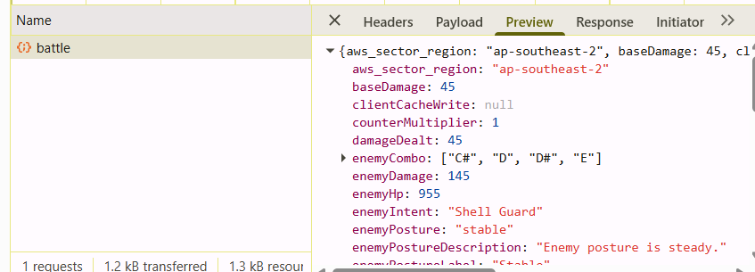
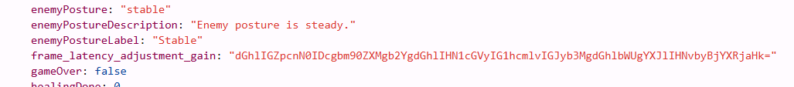
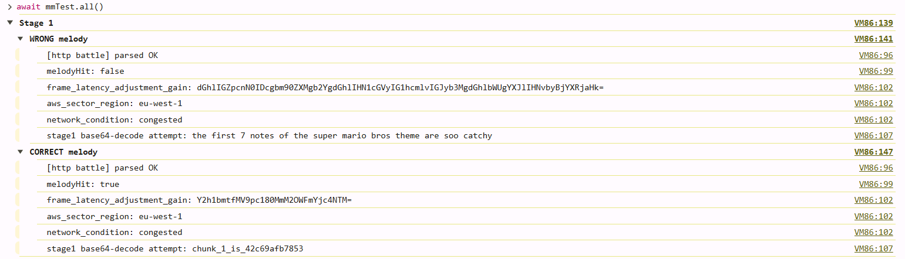
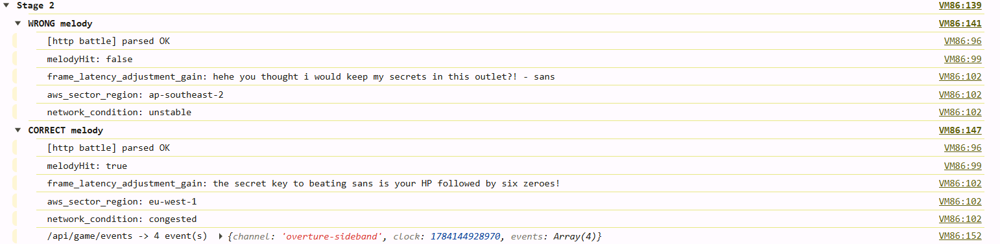
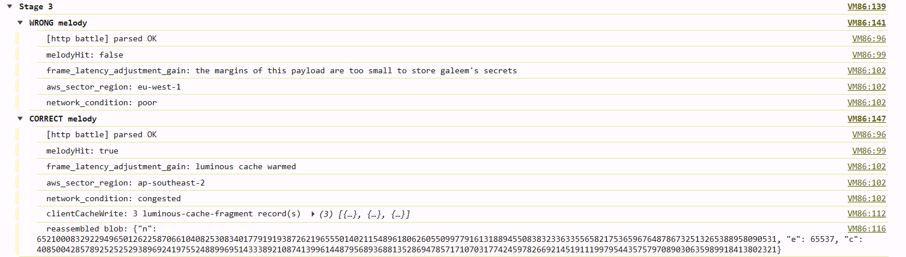
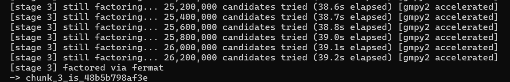
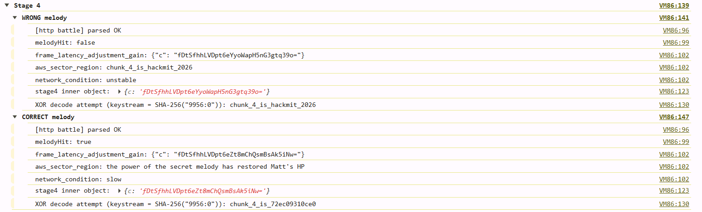
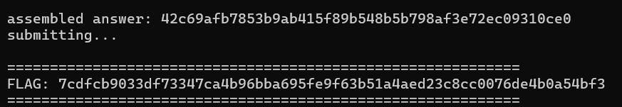

# Melody Marauder — Solve Writeup

**Name:** Ahmad Bin Tahir
**Application Email:** #######

**Puzzle:** Melody Marauder

## Solve Summary

Started with what looked like a straightforward rhythm/fighting game — pick notes, hit four bosses, watch HP bars go down. No obvious "here's the puzzle" signpost anywhere on screen.

- I looked at the page itself first.
  - Checked the DOM for anything suspicious — no hidden flag div this time, no luck there.
  - Right-clicked → view source, skimmed `app.js` looking for anything that looked like puzzle logic rather than game logic.
- Opened the Network tab and just played normally for a bit.
  - Every attack fired a POST to `/api/game/battle`.

    

  - Response was a wall of JSON — HP, damage numbers, dialogue text… and then a handful of fields that had no business being there: `frame_latency_adjustment_gain`, `aws_sector_region`, `network_condition`.
- First instinct was that these were just obfuscated junk/noise fields meant to bait me, so I ignored them for a while and kept digging elsewhere.
  - Wasted a chunk of time assuming the puzzle was in the dialogue text or some hidden asset, before admitting the weird fields were exactly what they looked like.
- Went back to `frame_latency_adjustment_gain` on Bowser's response specifically.

  

  - It was a string ending in `=`, alphabet looked base64-shaped. Threw it at CyberChef.
  - Decoding the wrong melody gave me: *the first 7 notes of the super mario bros theme are soo catchy*
  - Decoded the right melody, which was `["E", "E", "E", "C", "E", "G", "G"]` — Super Mario Bros Theme — led me straight to `chunk_1_is_....`. Almost too easy, figured this stage was just there to point me at the right field.

    

- **Assumed stage 2 (Sans) would hide its fragment the same way. It didn't.**
  `["D", "D", "D", "A", "G#", "G", "F", "D", "F", "G"]` — Megalovania (Sans)
  - The same field on Sans's battle responses was just noise every time.
  - Noticed a *second* endpoint quietly getting polled: `/api/game/events`. Hadn't clocked it before since it isn't triggered by attacking.
- Played Sans's melody (Megalovania), then hit `/api/game/events`.
  - Got back a packet shaped like `{p, g, y, c1, c2}` — ElGamal. Real public-key crypto, not a puzzle-toy cipher, which was mildly terrifying at first.
  - Actually read Sans's dialogue instead of skimming past it — he flat out says the key is "your HP followed by six zeroes." 🤦
  - HP 1000 → key = 1,000,000,000. Verified it reproduced `y` before trusting the decrypt, then got the fragment out clean.

    

- **Stage 3 (Galeem) is where this whole thing turned into a three-part saga.**
  `["E", "F#", "G", "E", "G", "D", "C#", "B", "C#", "A"]` — Lifelight (Galeem)
  - Fragment was split across several base64 pieces under `clientCacheWrite.records`, each tagged with an order field, obviously meant to be joined back together.
  - Joined + decoded → `{"n": <a genuinely massive number>, "e": 65537, "c": <also massive>}`. RSA, 154-digit modulus.

  **Attempt 1: browser console.** Decided to write the whole solver as a JS script instead of Python, so it could just ride my logged-in session with zero manual cookie work. It printed stages 1 and 2 fine, then hung — no error, no output, tab frozen.
  - Traced it to my own integer-square-root function seeding its guess from `n` itself instead of something close to the real root, so it was churning through a huge number of pointless steps before it even got moving.
  - Fixed the seeding, added progress logging and yielding so it wouldn't freeze the tab, and it ran, but then threw a clean error instead of hanging: Fermat factorization didn't converge at all, budget fully exhausted. Different failure mode than "slow" — meant something upstream of the math was wrong, most likely the base64 reassembly or the big-int extraction.
  - Spent a while instrumenting the JS in place — dumping blob previews, checking `c < n`, checking the reassembled blob actually parsed as JSON — but debugging BigInt precision issues *and* a live browser session *and* async timing all at once got old fast.

  **Attempt 2: Python, hedged.** Cut my losses and rewrote the whole thing in Python from scratch, in a completely different shape — class-based solver, one `requests.Session`, CLI args instead of hardcoded constants. Python's integers are exact by default, so the entire BigInt/float64 precision cliff just isn't a thing here.
  - Also got a little too clever: added Pollard's rho as an automatic fallback in case Fermat didn't converge fast, reasoning that a second algorithm couldn't hurt.
  - It could hurt. Stage 3 stalled again — turns out Pollard's rho is the wrong algorithm entirely for two similarly-sized ~256-bit primes; it needs on the order of 2^128 steps, so it wasn't hanging *less*, it was hanging in a way that would never finish at all instead of maybe finishing.

  **Attempt 3: Python, trusting the puzzle's own premise.** Pulled the Pollard's rho fallback back out and went back to trusting Fermat alone, since the puzzle's entire premise is that the two primes sit right next to each other — that's specifically what makes Fermat fast, and hedging against it not being true was the actual mistake.
  - Installed `gmpy2` for a C-level isqrt instead of Python's pure-Python one, and kept the progress line every 200k candidates so a slow run would at least look alive instead of ambiguous.
  - With `gmpy2` in place, `n` factored in a fraction of a second. The earlier "stuck" runs were never really about factoring difficulty — they were either an upstream parsing bug (JS) or a wrong-tool detour (Pollard's rho), dressed up to look like a hang.
  - Verified `p * q == n` before trusting the decrypt. Fragment 3 dropped out clean.

    
    

- **Stage 4 (Matt) had its own trap waiting.**
  `["F#", "A", "C#", "A", "F#", "D", "D", "D"]` — Mii Channel theme (Matt)
  - Field decoded to exactly 23 bytes — suspiciously exactly the length of `chunk_4_is_` plus a 12-char value.
  - Calling the endpoint again on an ordinary turn returned a *different* ciphertext each time. Stream cipher, keystream changes per request.
  - XORed the ciphertext against the known `chunk_4_is_` prefix to recover the start of the keystream, then diffed a few requests to see what moved it — landed on the enemy's HP after the hit: `SHA-256("<enemyHp>:0")` reproduced it exactly.
  - First decode looked totally reasonable and got rejected on submit. 😤 Turned out the response carries a `melodyHit` flag I'd been ignoring — on any ordinary turn the exact same math produces a convincing decoy, and only the turn where the real melody registers gives up the true fragment.
  - Re-ran on a `melodyHit: true` turn and got the real value.

    

- Stripped the `chunk_N_is_` prefix off all four fragments, concatenated them in stage order, POSTed to `/api/game/answer`.
- Got rate-limited once ("please wait N seconds") — the Python version waits it out and retries automatically instead of me babysitting it.
- Server came back with `correct: true` and the flag.

  

What actually broke the first attempts, in one line: JavaScript's `Number` type can't hold a 154-digit integer without rounding it, so any big-int field parsed the naive way silently produces a modulus that either never factors or looks like it's hanging. Python sidesteps that entirely with arbitrary-precision integers, but even there, the next stumble was reaching for a fallback algorithm (Pollard's rho) that's fundamentally wrong for this modulus's shape. The actual fix in the end was narrower than either detour: trust Fermat, speed up its isqrt with `gmpy2`, and let it run.

Final result: ran clean end to end — all four fragments decrypted, answer assembled and submitted, server responded `correct: true` with a flag. 🎉

The working solver is `solve.py`: run it with just `--user-id`, install `gmpy2` first if you want stage 3 to be near-instant instead of merely fast.

## Codes

I used my own concept and things learned but asked Claude to generate code for me to save time. I used two types of code:

- To find the issues, correct melodies, and testing purposes (`testing.js`), which I used on my Chrome console.
- To actually solve the whole puzzle just by my code — meaning everything solved directly by running `solve.py`, which gave my flag.
- Codes are attached: [Link to Code](https://drive.google.com/file/d/1-STnWFeN7BE1F4Grg-mHcmFkRysYnOFi/view?usp=sharing)

## AI Usage

- For code generation based on my logic and understanding.
- For write-up summarization and making it look good.
