# MIT OWIE — Solve Writeup

**Name:** Ahmad Bin Tahir
**Application Email:** #######

**Puzzle:** MIT OWIE

## Solve Summary

- Started the puzzle with absolutely no idea what to do. There was only a Wii Remote that could be moved around and clicked.
- Inspected the HTML looking for hidden clues.
  - Found a flag element in the body (yes, I even tried submitting it 😅).
  - Found a Base64 string inside an ornament's `data-key`, but it was just dummy content.

    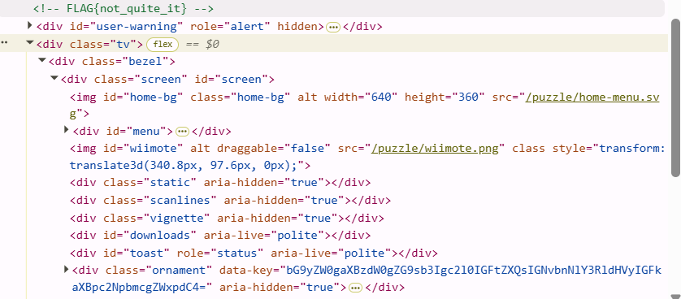

- Looked through the website's JavaScript to understand how the puzzle worked, but didn't find anything useful.
- Opened the **Network** tab and discovered that pressing **A** sent a request to `api/puzzle/unlock`.

  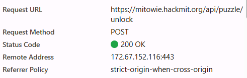

- Inspected the request and response.
  - Noticed it sent a parameter called `g`, which I assumed represented the Wii Remote's coordinates.

    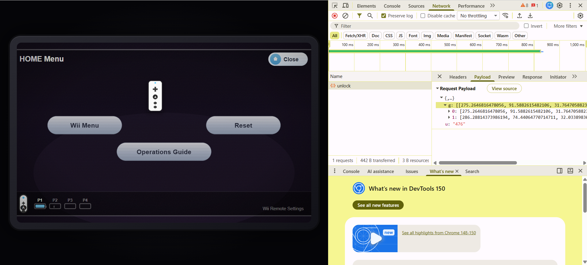

  - Realized there had to be a specific location where pressing **A** would trigger something.
- Clicked each and every part manually to find if a request was being made.
- Found a tiny area near the **Close** button (the icon) where the server finally returned a response instead of an empty one.

  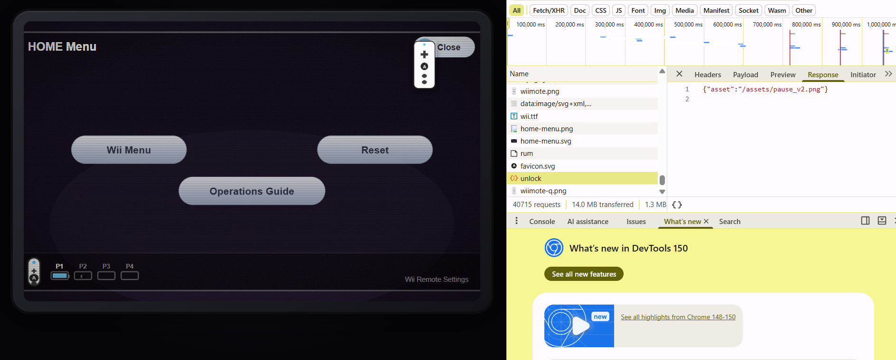

- The response contained half of an image URL.
  - Attached the site's base URL to it and downloaded the image.
- Got completely stuck because the pause image overlaid the page, preventing any further interaction.
- Wasted a lot of time taking screenshots and giving them to AI before realizing screenshots destroy the original image data and any embedded steganography.
- Downloaded the **original image** instead and analyzed it with **Aperi'Solve**.
- Discovered **108 bytes after the PNG IEND chunk**, which contained a Base64 string:

  ```
  aHR0cHM6Ly9kcml2ZS5nb29nbGUuY29tL2ZpbGUvZC8xTndtY0ZONmxWbnN0RExPTjBwWWU1OFRHQjc0WHBiaTkvdmlldw==
  ```

- Decoded the Base64 and obtained a **Google Drive** link:

  ```
  https://drive.google.com/file/d/1NwmcFN6lVnstDLON0pYe58TGB74Xpbi9/view
  ```

- Opened the Drive link expecting another clue…
  - It only contained an audio file. 😭
- Assumed the audio also contained hidden data.
  - Listened to it without success.
  - Generated a spectrogram using [Convert.ing-now.com](http://convert.ing-now.com).

    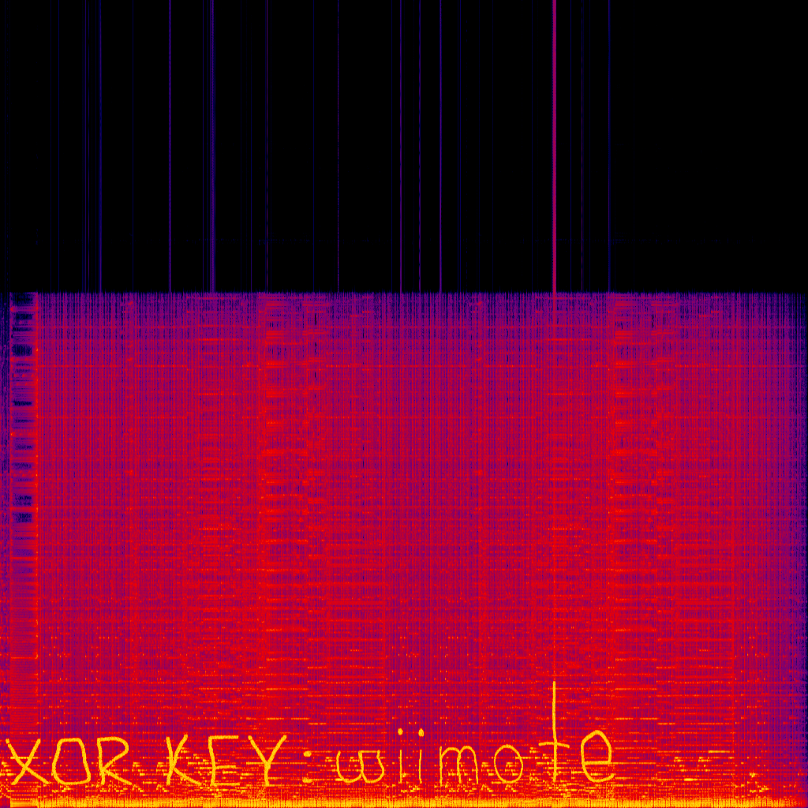

- The spectrogram revealed: **XOR KEY: wiimote**
- Spent a while trying to figure out what to XOR with the key.
- Eventually noticed that after unlocking the pause image, the frontend also replaced `wiimote.png` with `wiimote-q.png`.

  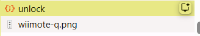
  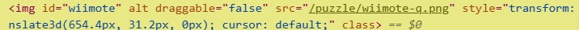

- Downloaded `wiimote-q.png`, analyzed it with **Aperi'Solve**, extracted the hidden data, and XOR-ed it using the key **WIIMOTE**.

  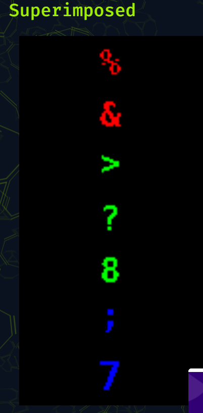

- The result was: **ROWRWOR**

  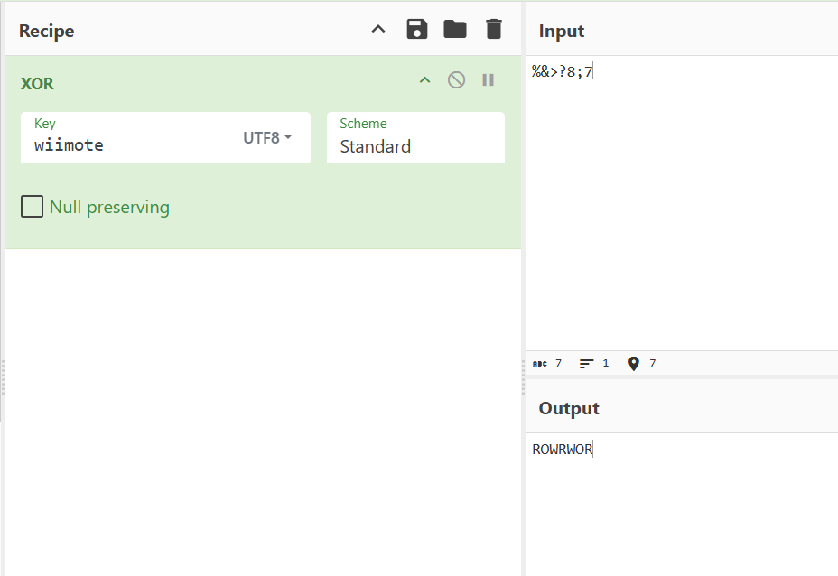

- Initially thought "Try reversing the sample" meant reversing the Wii Remote movements. Tried that… it didn't work.

  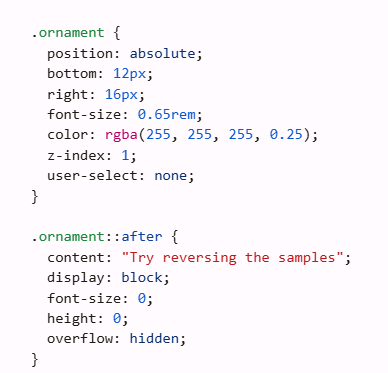

- Went back to inspecting everything again.
- Kept wondering why the three on-screen buttons even existed.
- Had a random intuition that **ROWRWOR** wasn't a word but a sequence of button presses.
- Pressed: **R → O → W → R → W → O → R**
- The first attempt failed because my aiming wasn't accurate enough.
- Tried again more carefully.
- It worked.
- Captured the flag. 🎉

  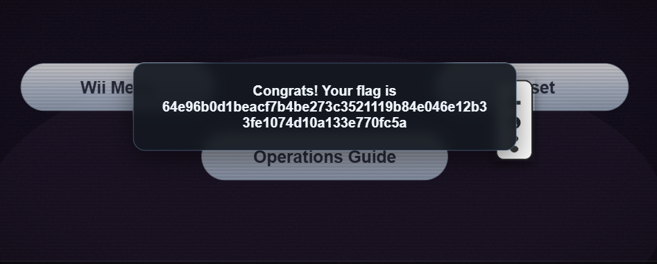

## Notes

- I didn't use Linux because I didn't have it set up and installed. So I used online tools.
- I was late because I accidentally started solving 2025 puzzles lol.
- This puzzle was my favourite one.
- At first it didn't make any sense, but step by step all the pieces connected together and I solved it.
- Server uses `/u/id` to generate the flag.
- Used AI for understanding, finding issues, finding hints and clues, and also for summarizing my write-up.
