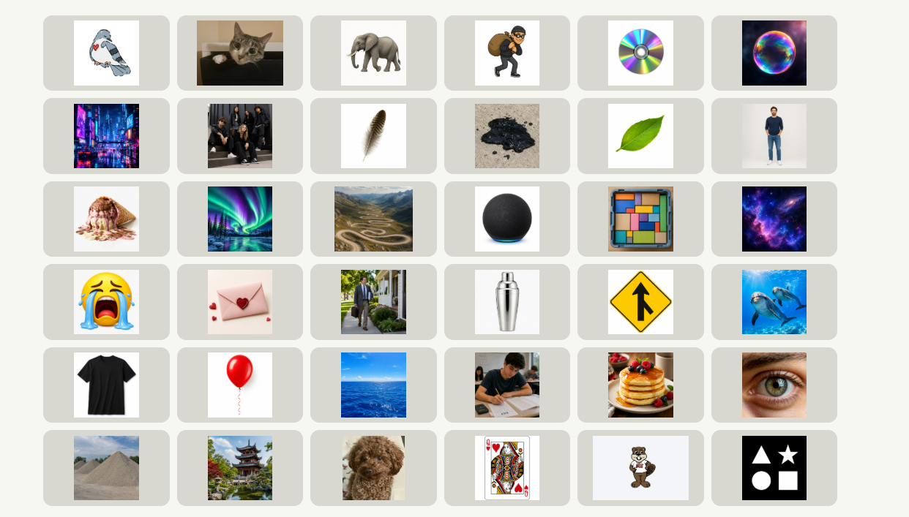
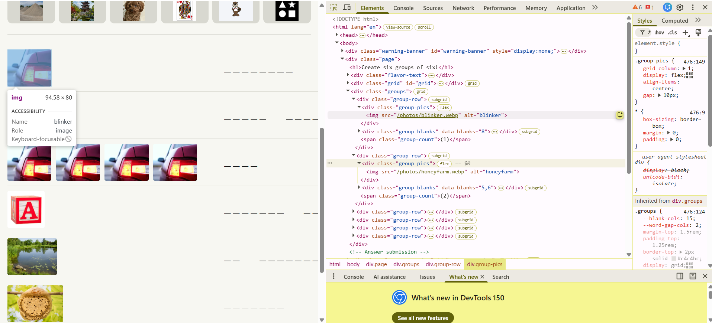
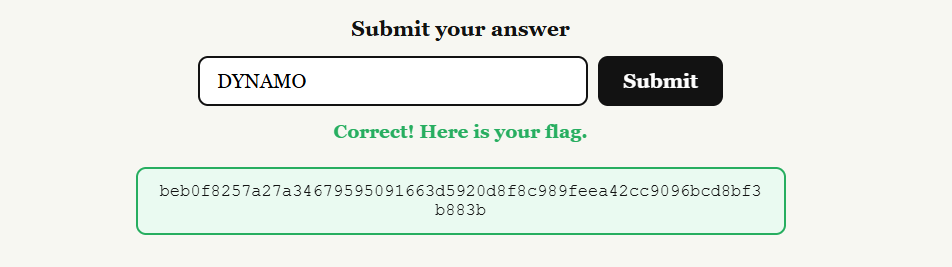

# Survival of the Sixes — Solve Writeup

**Name:** Ahmad Bin Tahir
**Application ID:** 476
**Application Email:** abt.ahmadbintahir@gmail.com
**Discord Username:** UnknownGamer4303

**Puzzle:** Survival of the Sixes

## Overview

The page showed a 6x6 grid of 36 photos, and below it six rows, each with a small target image, a number in parentheses, and a row of blank letters to fill in. There was flavor text at the top that read like game rules rather than puzzle instructions, and that turned out to be the actual entry point into the whole thing.



## Reading the Flavor Text

The flavor text said:

```
Every round, 30 players bite the dust
A team of 6 lives on
The field is infinite
```

I read this a couple of times before it clicked. 30 out of 36 is exactly the grid size minus the six target rows, so "30 bite the dust, 6 live on" is really just describing 36 going down to 6. "The field is infinite" was the part that gave away the actual mechanic to me, since an unbounded grid where cells live or die each round is Conway's Game of Life, not just a generic elimination theme. Once I had that, the small icons next to each row stopped looking like random doodles and started looking like specific Life patterns.

## Matching Icons to Life Patterns

I went through each of the six target icons and matched it to a known stable or oscillating Game of Life shape based on cell count and how the icon was drawn:

| Target icon | Life object | Behaviour | Cells |
|---|---|---|---|
| block | Block | still life | 4 |
| honeycomb shape | Beehive | still life | 6 |
| single blinking bar | Blinker | oscillator, period 2 | 3 |
| four brake lights | Traffic Light | four Blinkers arranged together | 12 |
| apiary icon | Honey Farm | four Beehives arranged together | 24 |
| pond shape | Pond | still life | 8 |

That confirmed six rows mapping to six distinct, well known Life objects, which matched the six rows on the page exactly.

## Working Out the Grouping

The part I had to think through the most was what the six photos in each row actually represented. My first read was that they were just six random images loosely themed together, but the flavor text specifically talks about live cells evolving on a board, not just being sorted into six random bins. So I treated each row as a claim: these six specific grid photos, if you mark their positions as alive and simulate Game of Life, settle into that row's target shape.

Practically, that means the six photos are not chosen for looking similar, they are chosen because their positions on the 6x6 board are the correct starting cells for that object. Working backward from the target shapes let me place each photo into exactly one of the six groups so that every group's positions were consistent with producing that group's object, and the 36 photos split cleanly with nothing left over and nothing shared between rows. I couldn't understand it until I checked the HTML and found out that these images had their named PNGs, while all of the images in the grid were unnamed, basically 0 to so on. So those gave me a hard time, but these helped me finalize things.



## Naming the Categories

Once the six groups were separated, I looked at what the photos in each group actually depicted, since the row of blanks below each group was clearly spelling out a category name that ties that specific set of six images together.

| Row | Life object | Category | Members |
|---|---|---|---|
| 1 | Blinker | DATABASE | Postgres elephant, SQLite feather, MongoDB leaf, Cassandra eye, Cosmos galaxy, MySQL dolphins |
| 2 | Honey Farm | CYBER ATTACK | Aurora, WannaCry, Meltdown, ILOVEYOU letter, lovebug pigeon, POODLE |
| 3 | Traffic Light | UNIX | cat, cd, tar, man, echo, tee |
| 4 | Block | FANTASY LANDS | Oz balloon, Atlantis ocean, Shangri-La pagoda, Wonderland queen, Flatland shapes, Night City neon |
| 5 | Pond | NP-COMPLETE | knapsack burglar, clique, Hamiltonian road, bin-packing blocks, TSP salesman, SAT |
| 6 | Beehive | SORTING | bubble, cocktail shaker, merge, pancake, heap, Timsort |

Recognizing each category took some digging since a few of the images were fairly obscure references, but once one or two images in a row clicked, the rest of the theme usually confirmed itself quickly.

## Pulling the Answer

The number in parentheses next to each row was the last piece. It told me which letter position to take from that row's category name. I went row by row:

| Row | Category | Number | Letter |
|---|---|---|---|
| 1 | DATABASE | 1 | D |
| 2 | CYBER ATTACK | 2 | Y |
| 3 | UNIX | 2 | N |
| 4 | FANTASY LANDS | 2 | A |
| 5 | NP-COMPLETE | 5 | M |
| 6 | SORTING | 2 | O |

Reading the letters down in row order gives the final answer:

**DYNAMO**

What made this one satisfying was that DynamoDB is itself a database, which loops back to the first category in the list. That felt like a deliberate nod rather than a coincidence, and it was the moment I was confident the answer was right before even submitting it.



## Notes

- The flavor text was the actual key to the puzzle, not just decoration. Reading it as literal game rules rather than theme text was what unlocked the Game of Life connection.
- The hardest part was not the Life simulation itself, it was correctly identifying the more obscure images inside each category, especially the cyberattack and fantasy lands rows.
- Used AI to help confirm some of the more obscure image identifications and to help organize this write-up.
