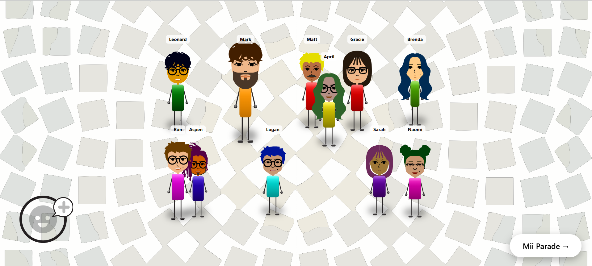
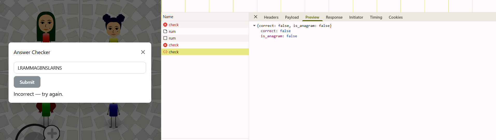
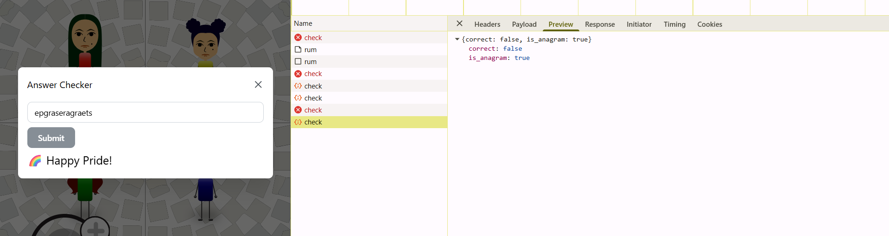
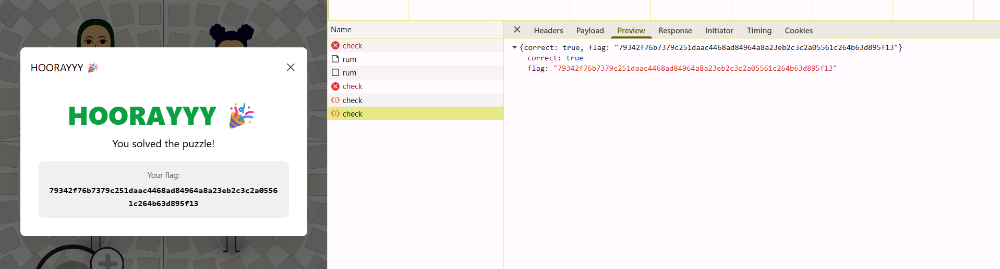

# Wii Are Family — Solve Writeup

**Name:** Ahmad Bin Tahir
**Application ID:** 476
**Application Email:** abt.ahmadbintahir@gmail.com
**Discord Username:** UnknownGamer4303

**Puzzle:** Wii Are Family

## Overview

The puzzle showed fifteen Miis split across a Mii Plaza page and a Mii Parade page. Clicking a Mii opened a modal listing its traits: face shape, hair, brows, eyes, nose, mouth, glasses, beard, and beauty mark. Nothing on the surface said what to do with any of this. I could not solve it before the hint dropped, and this write-up is honest about that.



## Before the Hint

Without a hint I had no real structure to work from, so I tried a few angles that all ended up wrong:

- **Odd one out:** comparing all fifteen Miis to see if one did not belong.
- **Resemblance matching:** pairing Miis by which two looked most alike.
- **Anagram, done wrong:** taking the first letter of every Mii's name, all fifteen, same position each time, and trying to rearrange that into a word. This failed because it used the same character position for every Mii regardless of generation. The anagram only works when you pull a different letter position per generation — first letter for generation one, second letter for generation two, and so on — not the same position across the whole list. I had the right idea, anagram, attached to the wrong method, fixed position, and I did not have the generation structure yet to know that the position needed to shift.

  
  

None of these gave me a way to actually connect the Miis to each other, so I was just guessing until the hint came out. After the hint it made sense, and the actual values made the anagram true.

## Decoding the Hint

The hint was a chain of riddles. Decoding each piece gave the entire skeleton of the puzzle:

| Riddle piece | Decodes to | Meaning |
|---|---|---|
| A dog's warning sound, but no what mosquitoes do | growl, no bite | Family tree |
| What a will leaves behind, and what a portrait painter tries to capture | inheritance, resemblance | Connections come from shared traits |
| A sun-powered organism's part that turns light into lunch | leaf (of a plant) | Parade Miis are the leaves of the tree |
| The number of eyes watching this clue | two | The tree has two roots |
| Enhance flavor by adding spices, times a year, between a cake's layers | season x 4, frosting | The tree has four generations |

So the puzzle was a family tree with two roots and four generations, and the Parade Miis were specifically the leaf generation at the end.

## Finding the Real Connections

My first guess was that on-screen position meant something, since the Miis were scattered around the plaza. That was a dead end — the positions are randomized purely for layout.

The real connection was hidden in the trait data itself. Comparing all fifteen Miis, three traits kept repeating in identical combinations across specific groups:

- Face shape
- Eyes
- Nose

Whenever a set of Miis shared the same face shape, eyes, and nose, that was the signal they belonged to the same branch. Grouping by this rule split all fifteen Miis cleanly into four generations, matching the four seasons and four cake layers from the hint, with none left over:

| Generation | Size | Role |
|---|---|---|
| Generation 1 | 2 Miis | Roots |
| Generation 2 | 5 Miis | Branch |
| Generation 3 | 4 Miis | Branch |
| Generation 4 | 4 Miis | Leaves (Parade Miis) |

## Tree Structure

```
Generation 1 (roots)
   Gracie ── Ron
        │
   ┌────┼────┬────┬────┐
Generation 2 (5 Miis)
Matt  April  Leonard  Aspen  Naomi
        │
   ┌────┼────┐
Generation 3 (4 Miis)
Mark  Brenda  Logan  Sarah
        │
   ┌────┼────┐
Generation 4 (4 Miis, Parade / leaves)
Selena  Nora  Anita  Russell
```

## Ordering Within Each Generation

Each Mii had a distinct shirt colour. Sorting every generation in rainbow order, red through violet, using the colour data in the rendered SVGs gave a clean, unambiguous sequence for each generation, with no guessing involved:

| Generation | Order (rainbow, by shirt colour) |
|---|---|
| Generation 1 | Gracie → Ron |
| Generation 2 | Matt → April → Leonard → Aspen → Naomi |
| Generation 3 | Mark → Brenda → Logan → Sarah |
| Generation 4 | Selena → Nora → Anita → Russell |

## Extracting the Letters

With four generations, the natural guess was that each generation pulls a different letter position from its members' names — generation 1 uses letter 1, generation 2 uses letter 2, and so on. This is also the fix to the anagram attempt from before the hint: the position needed to shift per generation instead of staying fixed at the first letter.

| Gen | Letter used | Names → Letters | Result |
|---|---|---|---|
| 1 | 1st letter | Gracie → G, Ron → R | GR |
| 2 | 2nd letter | Matt → A, April → P, Leonard → E, Aspen → S, Naomi → A | APESA |
| 3 | 3rd letter | Mark → R, Brenda → E, Logan → G, Sarah → R | REGR |
| 4 | 4th letter | Selena → E, Nora → A, Anita → T, Russell → S | EATS |

## Final Answer

Concatenating the four results in generation order:

```
GR + APESA + REGR + EATS = GRAPESAREGREATS
```

Which reads as "grapes are greats". Removing spaces to match the submission format:

**grapesaregreats**



## Notes

- Could not solve this without the hint, and I am not pretending otherwise.
- The pre-hint anagram attempt was close in spirit but wrong in execution: same letter position across all Miis instead of a shifting position per generation.
- Face shape, eyes, and nose were the actual key to grouping the tree, not position on screen and not visual resemblance guessing.
- Used AI to help decode the wordplay in the hint, sanity check the trait groupings, and clean up this write-up.
